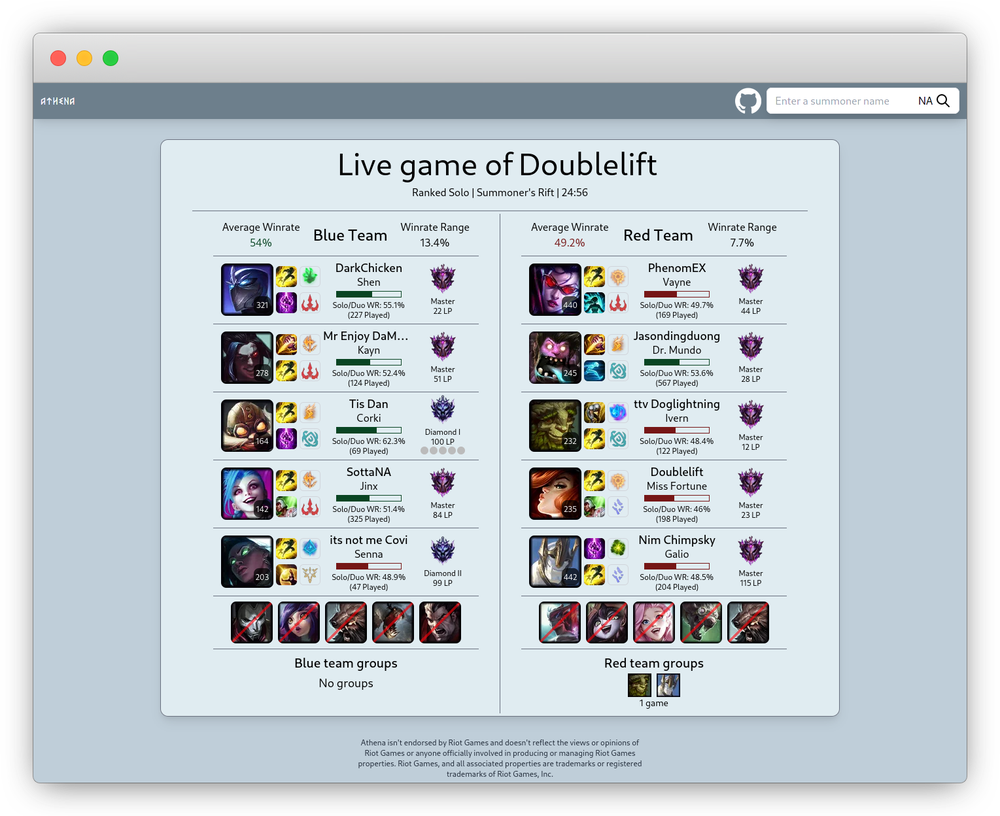
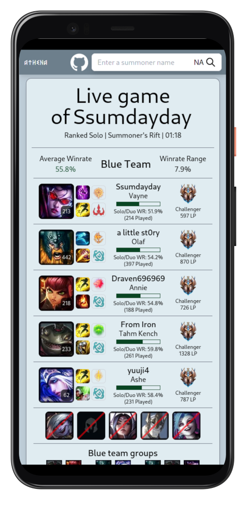

[](https://drone.greg2010.me/greg2010/Athena/)
[](https://github.com/greg2010/Athena/blob/master/LICENSE)
[](https://discord.gg/VMTW7MfnRN)
[][discord-invite-link]

<div align="center">
<h1>Athena</h1>
<a href="https://lol.krabsin.space">
  
</a>
<a href="https://lol.krabsin.space">
  
</a>
</div>

Athena is an open-source companion webapp for League of Legends. Think op.gg, Mobalytics, or Blitz, but free,
open-source and community-driven. It is licensed under AGPL-3.0 and is designed to be self-hosted. In addition, the
hosted version is available at [lol.krabsin.space](https://lol.krabsin.space).

Athena is written in modern, purely functional Scala and ScalaJS.

### Features
- Search for an ongoing game by the summoner name of any of the participants
- Level, rank, winrate information for all players in the game
- Summary information about the participating teams in the game
- Information about premade groups on each team

### Notable libraries

- We use [ZIO](https://github.com/zio/zio) as our effect library of choice.
- [Http4s](https://github.com/http4s/http4s) is used to serve the service's REST API.
- [Laminar](https://github.com/raquo/Laminar), a minimal FRP framework is used on the frontend.
- Frontend makes use of [imgproxy](https://github.com/imgproxy/imgproxy) to resize remote assets on the fly.
- [Webpack](https://github.com/webpack/webpack) is used for asset packaging and minification.

## Usage

### Obtaining a Riot API Key

To make use of the app, you need a valid Riot API key. To test the service locally you can obtain a temporary developer
API key on the [Riot Developer portal](https://developer.riotgames.com/). This key needs to be renewed every day, and
per Riot Terms of Service cannot be used for any publicly available services.

For more permanent deployments, request the appropriate personal or production API Key through the developer portal. The
approval period is anywhere between a couple of days and a couple of weeks. For more information on the application
process refer to the
official [documentation](https://developer.riotgames.com/docs/portal#product-registration_application-process).

### Running the service

The primary way of distributing Athena is docker. You need backend to interact with Riot API, and frontend to serve the
webapp.

```bash
docker run -e ATHENA_RIOT_API_KEY=your_api_key \
           -e ATHENA_HTTP_PORT=8081 \
           -p 8081:8081 \
           -d \
           ghcr.io/greg2010/athena-backend:latest
docker run -e BACKEND_API_URL=http://localhost:8081 \
           -e FRONTEND_URL=http://localhost:8080 \
           -p 8080:80 \
           -d \
           ghcr.io/greg2010/athena-frontend:latest
```

The application is fully stateless, with an in-memory cache for efficient API usage.

### Environment variables

The full reference of all available environment variables, as well as the default values is available in the source
code. Please refer to the following files:

- Backend:
  [application.conf](https://github.com/greg2010/Athena/blob/master/backend/src/main/resources/application.conf)

- Frontend: [.env](https://github.com/greg2010/Athena/blob/master/frontend/.env)

## Support

If you have found a bug, or have an idea how Athena can be improved, please open a Github issue. For any questions regarding the
app, the process of hosting the service, or other, join our [discord][discord-invite-link].

***Note: please do not use issues in this repository for support questions. Talk to us on discord instead.***

## Contributing

Pull requests are welcome. For major changes, please open an issue first to discuss what you would like to change. Come
chat with us on [discord][discord-invite-link] if you have any questions, ideas or concerns.

### Setting up the development environment

To compile the service locally, you need

- `JDK` (>= 11)
- `sbt`(>= 1)
- `node` (>= 12)
- `yarn`
- `inotify-tools`

Please refer to your distro's instructions on package management for further details on how to install the required
packages.

### Backend

To start the backend locally, run

```bash
sbt backend/run
```

be sure to have the environment variable set for the Riot API key. The service will not start without it.

### Frontend

To start a revolving environment for the frontend development (akin to what create-react-app provides out of the box)
run

```bash
cd frontend; ./up.sh
```

This will start the local Webpack development server on `localhost:8080`. If a different host/port is desired, pass the
respective environment variables to `up.sh`, e.g.

```bash
cd frontend; HOST=0.0.0.0 PORT=8081 ./up.sh
```

Supply any frontend application-specific environment variables in `frontend/.env.local`.
See [.env](https://github.com/greg2010/Athena/blob/master/frontend/.env) for reference.

## Versioning

At this point we are not doing versioned releases. Use the commit tagged images for stable deployments instead. Master
branch images can be assumed stable and suitable for public releases.

## Roadmap
% TODO

## Disclaimer
Athena isn't endorsed by Riot Games and doesn't reflect the views or opinions of Riot Games or anyone officially involved in producing or managing Riot Games properties. Riot Games, and all associated properties are trademarks or registered trademarks of Riot Games, Inc.

## License

[AGPL-3.0](https://choosealicense.com/licenses/agpl-3.0/)


[discord-invite-link]: https://discord.gg/VMTW7MfnRN
